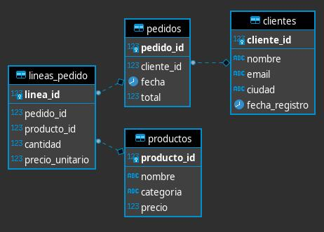

# ecommerce-insights-sql
SQL analytics project using PostgreSQL and Docker. Covers querying, aggregations and JOIN operations over a simulated e-commerce database with clients, products and orders.


## Motivation

This project was developed to practice SQL over a simulated e-commerce database, 
answering business questions such as:

**Basic queries**
- What are the names and emails of all our customers?
- Which customers live in Madrid?
- Which products have a price greater than 100€?
- Which products belong to the 'Electronics' category?
- Show all products ordered from cheapest to most expensive.

**Aggregations**
- How many customers do we have registered in total?
- What is the price of the most expensive product?
- What is the average value of all orders placed?
- How much total revenue has the store generated?

**JOINs & Advanced queries**
- Show the customer name and date for each order placed.
- List the top 10 customers by total spending.
- For each product category, show units sold and total revenue.
- Find customers who registered in 2024 but have never placed an order.
- Show the ranking of best-selling products including their percentage of total sales.

Built with PostgreSQL as the database engine and Docker to spin up a fully reproducible environment.

## Database Schema


## Project Structure

```
ecommerce-insights-sql/
├── queries/
│   └── consultas.sql
├── img/
│   └── diagram.png
├── init/
│   ├── 01_practica_ecommerce.sql
│   └── 02_datos_adicionales_ecommerce.sql
├── docker-compose.yml
├── .env.example
├── .gitignore
└── README.md
```

## Technologies & Libraries

- **Database:** PostgreSQL 17
- **Containerization:** Docker 29.3.0
- **Container Orchestration:** Docker Compose 5.1.0

## How to run it 

## What I Learned

Working on the last queries taught me two important lessons:

When using subqueries with `NOT IN`, it is critical to check for `NULL` values in the subquery result — if any `NULL` exists, the entire condition silently returns no rows. A `LEFT JOIN` checking for `IS NULL` is safer and more explicit in these cases.

I also learned that replacing `JOIN + subquery` combinations with a CTE makes queries more efficient and readable. With a subquery inside a `SELECT`, it executes once per row — which limits what you can calculate, like percentages over a total. With a CTE, the data is pre-calculated once and reused freely, reducing complexity and enabling window functions like `RANK()` and `SUM() OVER ()`.


<details>
<summary> Ver en Español</summary>

El desarrollo de las últimas consultas me dejó dos aprendizajes importantes:

Al usar subconsultas con `NOT IN`, es fundamental verificar la existencia de valores `NULL` en el resultado — si existe algún `NULL`, la condición no devuelve ninguna fila sin dar ningún error. Un `LEFT JOIN` verificando `IS NULL` es más seguro y explícito en estos casos.

También aprendí que reemplazar combinaciones de `JOIN + subconsulta` por un CTE hace las consultas más eficientes y legibles. Con una subconsulta dentro del `SELECT`, esta se ejecuta una vez por cada fila — lo que limita los cálculos posibles, como porcentajes sobre un total. Con un CTE, los datos se pre-calculan una sola vez y se reutilizan libremente, reduciendo la complejidad y permitiendo el uso de window functions como `RANK()` y `SUM() OVER ()`.

</details>

## Sample queries


## Acknowledgements

This project is based on an exercise from the **Data Engineering Bootcamp** by [ANBAN](https://academia.asociacionbigdata.es/) x [DataOrigin](https://www.dataorigin.es/).

## Author

**Maye**
- GitHub: [@MayeLabs](https://github.com/MayeLabs)
- LinkedIn: [@maye96](https://www.linkedin.com/in/maye96/)